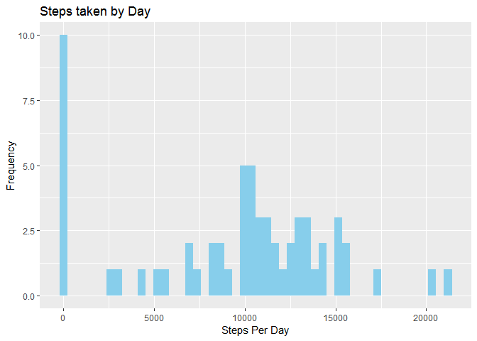
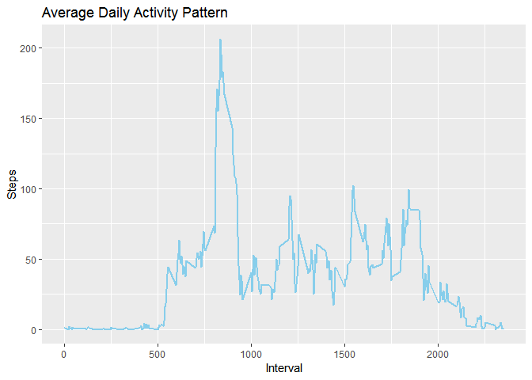
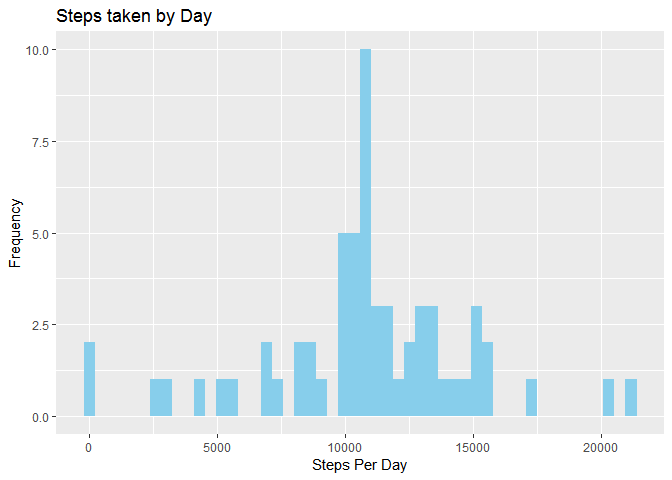
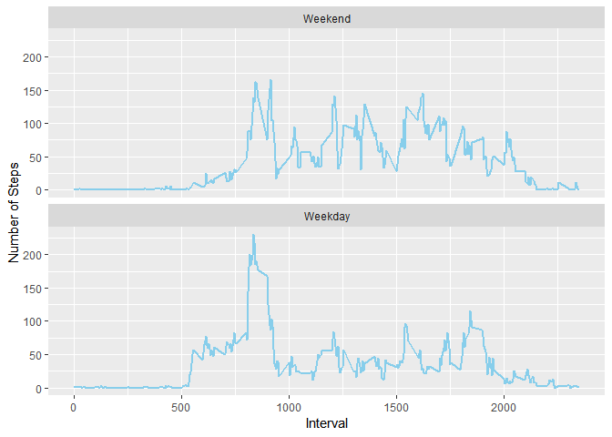

##Details
Dataset: Activity monitoring data 
The variables included in this dataset are:   
steps: Number of steps taking in a 5-minute interval (missing values are coded as NA)  
date: The date on which the measurement was taken in YYYY-MM-DD format  
interval: Identifier for the 5-minute interval in which measurement was taken  
The dataset is stored in a comma-separated-value (CSV) file and there are a total of 17,568 observations in this dataset.

###Required Libraries and global options set 

```r
library(ggplot2)
library(dplyr)
```

```
## 
## Attaching package: 'dplyr'
```

```
## The following objects are masked from 'package:stats':
## 
##     filter, lag
```

```
## The following objects are masked from 'package:base':
## 
##     intersect, setdiff, setequal, union
```

```r
options(scipen = 999)
```

## Loading and preprocessing the data

```r
setwd("C:/Users/shodas/Documents/Data Science Coursera/RepData_PeerAssessment1")
activityData <- read.csv(unz("activity.zip", "activity.csv"), header = TRUE,
                         sep = ",") 
activityData$date <- as.Date(activityData$date, format="%Y-%m-%d")
```

## What is mean total number of steps taken per day?
###1.Calculate the total number of steps taken per day

```r
actvtyDataSummaryDay <- as.data.frame(activityData %>% group_by(date)  %>%  summarize(totalSteps = sum(steps,  na.rm = TRUE)))
actvtyDataSummaryDay[,c("date","totalSteps")]
```

```
##          date totalSteps
## 1  2012-10-01          0
## 2  2012-10-02        126
## 3  2012-10-03      11352
## 4  2012-10-04      12116
## 5  2012-10-05      13294
## 6  2012-10-06      15420
## 7  2012-10-07      11015
## 8  2012-10-08          0
## 9  2012-10-09      12811
## 10 2012-10-10       9900
## 11 2012-10-11      10304
## 12 2012-10-12      17382
## 13 2012-10-13      12426
## 14 2012-10-14      15098
## 15 2012-10-15      10139
## 16 2012-10-16      15084
## 17 2012-10-17      13452
## 18 2012-10-18      10056
## 19 2012-10-19      11829
## 20 2012-10-20      10395
## 21 2012-10-21       8821
## 22 2012-10-22      13460
## 23 2012-10-23       8918
## 24 2012-10-24       8355
## 25 2012-10-25       2492
## 26 2012-10-26       6778
## 27 2012-10-27      10119
## 28 2012-10-28      11458
## 29 2012-10-29       5018
## 30 2012-10-30       9819
## 31 2012-10-31      15414
## 32 2012-11-01          0
## 33 2012-11-02      10600
## 34 2012-11-03      10571
## 35 2012-11-04          0
## 36 2012-11-05      10439
## 37 2012-11-06       8334
## 38 2012-11-07      12883
## 39 2012-11-08       3219
## 40 2012-11-09          0
## 41 2012-11-10          0
## 42 2012-11-11      12608
## 43 2012-11-12      10765
## 44 2012-11-13       7336
## 45 2012-11-14          0
## 46 2012-11-15         41
## 47 2012-11-16       5441
## 48 2012-11-17      14339
## 49 2012-11-18      15110
## 50 2012-11-19       8841
## 51 2012-11-20       4472
## 52 2012-11-21      12787
## 53 2012-11-22      20427
## 54 2012-11-23      21194
## 55 2012-11-24      14478
## 56 2012-11-25      11834
## 57 2012-11-26      11162
## 58 2012-11-27      13646
## 59 2012-11-28      10183
## 60 2012-11-29       7047
## 61 2012-11-30          0
```

###2.Make a histogram of the total number of steps taken each day

```r
hist1 <- ggplot(actvtyDataSummaryDay, aes(actvtyDataSummaryDay$totalSteps)) +  geom_histogram(bins=50, fill="skyblue")
hist1 + labs(title = "Steps taken by Day", x = "Steps Per Day", y = "Frequency")
```

<!-- -->

###3. Calculate and report the mean and median of the total number of steps taken per day


```r
mean_steps <- mean(actvtyDataSummaryDay$totalSteps)
```
Mean of the Total number of Steps taken per day is 9354.2295082

```r
median_steps <- median(actvtyDataSummaryDay$totalSteps)
```
Median of the Total number of Steps taken per day is 10395


## What is the average daily activity pattern?

```r
avgStepsInterval <- activityData %>% group_by(interval)  %>%  summarize(avgSteps = mean(steps,  na.rm = TRUE)) 
timeSeries <- ggplot(data = avgStepsInterval, aes(x = interval, y = avgSteps)) + geom_line(color = "skyblue", size = 1)+               labs(title = "Average Daily Activity Pattern", x = "Interval", y = "Steps")
timeSeries
```

<!-- -->

###Which 5-minute interval, on average across all the days in the dataset, contains the maximum number of steps?

```r
maxSteps <- as.data.frame(avgStepsInterval[which.max(avgStepsInterval$avgSteps),])
maxStepsInterval <- maxSteps[1,1]
maxStep <- maxSteps[1,2]
```
835 - this interval contains the maximum number of steps, of value 206.1698113.  

## Imputing missing values
###Calculate and report the total number of missing values in the dataset:

```r
missingValues <- sum(is.na(activityData$steps)) 
```
Total number of missing values in the dataset 2304
###Strategy for filling in all of the missing values in the dataset. 
 The missing values are going to be filled in using the mean value of steps taken in that interval.

###Dataset with filled in missing data.

```r
imputedActivityData <- activityData %>% group_by(interval) %>% mutate(steps = ifelse(is.na(steps), mean(steps, na.rm=TRUE), steps))
```
###Histogram of the total number of steps taken each day and Calculate and report the mean and median total number of steps taken per day. Do these values differ from the estimates from the first part of the assignment? What is the impact of imputing missing data on the estimates of the total daily number of steps?

```r
imputedDataSummaryDay <- imputedActivityData %>% group_by(date)  %>%  summarize(totalSteps = sum(steps,  na.rm =TRUE))
hist2 <- ggplot(imputedDataSummaryDay, aes(imputedDataSummaryDay$totalSteps)) +  geom_histogram(bins=50, fill="skyblue")
hist2 + labs(title = "Steps taken by Day", x = "Steps Per Day", y = "Frequency")
```

<!-- -->

```r
imputed_mean_steps <- mean(imputedDataSummaryDay$totalSteps)
```
Mean of the Total number of Steps taken per day is 10766.1886792

```r
imputed_median_steps <- median(imputedDataSummaryDay$totalSteps)
```
Median of the Total number of Steps taken per day is 10766.1886792

Mean steps has been changed from 9354.2295082 to 10766.1886792 
and Median has been changed from 10395 to 10766.1886792.


## Are there differences in activity patterns between weekdays and weekends?
###Factor variable with two levels - "weekday" and "weekend" indicating whether a given date is a weekday or weekend day.


```r
weekdays1 <- c('Monday', 'Tuesday', 'Wednesday', 'Thursday', 'Friday')
imputedActivityData$week  <- factor((weekdays(imputedActivityData$date) %in% weekdays1), 
                   levels=c(FALSE, TRUE), labels=c('Weekend', 'Weekday'))
```

###Time series panel plot of the 5-minute interval and the average number of steps taken, averaged across all weekday days or weekend days. 

```r
imputedActivityummary <- imputedActivityData %>% group_by(interval, week)  %>%  summarize(totalSteps = mean(steps))
weekdayplot <- ggplot(imputedActivityummary, aes(x= interval, y = totalSteps)) + geom_line(col = 'skyblue', size = 1) +facet_wrap(vars(week), nrow = 2) + labs (x = 'Interval', y = 'Number of Steps')

weekdayplot
```

<!-- -->
